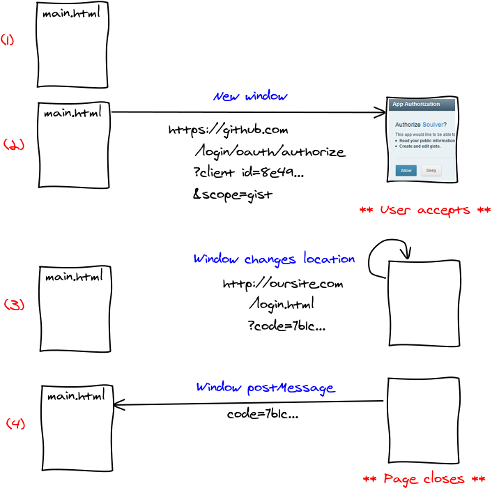

Hey there!

<!--truncate-->

In this blog post, I will walk you through how we can connect and interact with Github API without the hassle.

Github API documentation is packed with tons of features and endpoints, which could result in information overload especially if anyone is starting first, at least what happened in my case.

So the goal of this blog post is how we can set up our application and interact with Github API.

If we head over to [**Github Developer**](https://developer.github.com/v3/), we can see details related to GitHub REST API version 3, including various Root endpoints, Authentication, Schema and so on.

The API access is via HTTPS with the base endpoint hitting at `https://api.github.com`. However, we cannot access the private information of any repository of any user without any kind of authentication.

Therefore, We have various ways to authenticate through GitHub API v3. If we try to fetch information that requires any kind of authentication, it will return either `404 Not Found` or `403 Forbidden`

The GitHub API provides us two ways for authentication to get access to private details from the repository.

**1.** _Basic Authentication : Using username as query parametres_

**2.** _OAuth2 Token : Using Auth Token_

While with the basic authentication, the user access would be very limited to the GitHub, It is advisable to go with the Auth Token based approach.
Therefore, Let's go step-by-step with our 2nd approach.

### Building OAuth Applications

Building an OAuth application using GitHub consists of basically **2** key points, as mentioned below:

**1.** **Creating an OAuth App** : Go to [**Developer Settings**](https://github.com/settings/developers) , and register a new application.
we need to provide the following fields :

1. Application Name : Name of the application
2. Homepage URL : The address of the application, If you're in development mode, you can put `localhost:3000`
3. Application Description : A basic description of what you're building.
4. Application Callback URL : A callback URL, to which the application would return after GitHub authentication

The point of submitting the details is we get a _client_id_ which we will use further below


**2** **Authorizing OAuth Apps** : This is the most crucial step where the authentication happens.you can enable users to authorize your apps using either traditional way such as _Redirect URLs_ , _Non-Web application flow_ or using a more modern approach such as _Web-application_ flow, which we are going to discuss here.

First, send the request to the Github API using _client ID_ as a query parameter and a redirection URL (it would possibly be your localhost), as shown below:

```
https://github.com/login/oauth/authorize?client_id=${CLIENT_ID}&scope=user&redirect_uri=${REDIRECT_URI};
```

You might trigger this link on a button click, in your application. The application would jump to a new URL then after getting a _unique code_ it would redirect back your application (in this case the `localhost`).

Now, according to the GitHub developer documentation, we can exchange this `code` for our `access token`, now with the access token, we can pretty much send all kind of private requests to the GitHub, for that to be done, we need to send the `code` as a query parameters as well, _but where??_

_There are various third party middleware that provides this service, one such very popular project is called_ [Gatekeeper](https://github.com/prose/gatekeeper) _This would act as middleware and exchange your `code` with an `access token`_

_But what is Gatekeeper and how does it solve our problem?_
Well, due to security limitations called cross origin browser compatiblity, GitHub does not allow the implementation of any OAuth Web application from client side. So third party libraries like Gatekeeper tricks the API and joins the missing piece of the puzzle. It enables client side application authentication to the GitHub developer API.

However, GitHub is in works to solve this issue of including a 3rd party middleware workaround, and could come up with a solution very soon hopefully.

The Gatekeeper library works very well with _github.js_ (which helps in accessing the GitHub API from the browser)

You can send request as follows :

```
fetch(`https://yourOwnCreatedDomainUsingGatekeeper.herokuapp.com/authenticate/${code}`)
        .then(response => response.json())
        .then(({ token }) => {
            console.log("Access Token", token)
        };
```

After successfully getting the _access token_ , now we can send _authenticated_ network request with the access token in our header to the GitHub API endpoints mentioned in the documentation.

_An easy to understand diagram covering important points in this post_



You can either use `raw GitHub endpoints` as it is in the documentation or use a high-level wrapper which makes things incredibly easier according to the programming language of our choice while making endpoint requests.

One such very popular and official high-level wrapper for handling GitHub endpoint requests is [Octokit](https://github.com/octokit). It makes things easier, and the documentation is well-written.

I have created a simple page where on click of a button, the user will be authenticated likewise the steps mentioned in this post.
Please find it in the _[Repository](https://github.com/abhinav-anshul/Github-Auth)_
