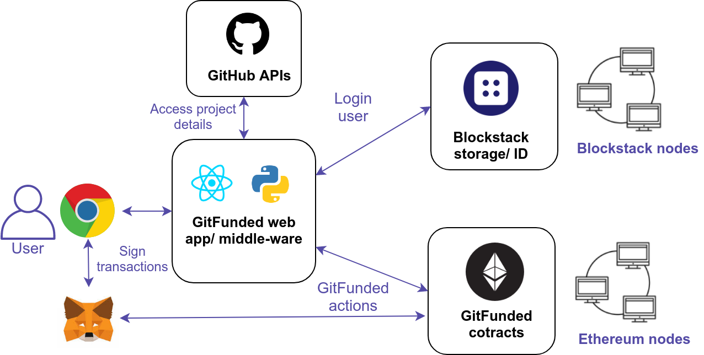

# Entities

GitFunded comprises of several diferent entities with different roles. The role
 of the entity depends on the action they perform on the platform.

## Project admin

Admin is responsible for creating the project by referencing a GitHub project. Admin has few specific roles:

* Providing initial details of the project
* Setting initial funding goals and expenses
* Accept the expenses and bounties for the issues/ tasks
* Deleting the project and thus refunding the funded amount
 

## Project sponsor

Project sponsor fund the desired project. Sponsor can be a DAO such as MolochDAO, DAOStack

* Funds the project with any crypto currencies (currently ERC20 tokens)
* Receives the funded amount back in case project discontinues

## Project member

Member is the contributor of the project, often developer

* Creates issues/ tasks for the project
* Adds project expenses
* Works on an existing issue/ task

## Watcher

Everyone passing the GitFunded is a watcher. But logged in entities can choose to follow specific
 project to get notified about the activities.
 
 
## Technical architecture
The following technical architecture diagram consists of all the protocols and services used by GitFunded. 

### GitFunded actions involve:
* Creating a project (admin)
    * Add description
    * Set funding goal
* Add expense (admin, member)
* Accept expense (admin)
* Add task (admin, member)
* Accept task (admin)
* Fund project (sponsor, member, admin)
* Discontinue project (admin)

## High level architecture

