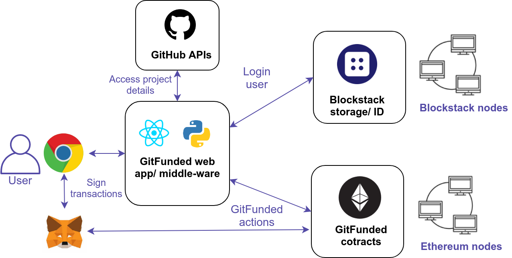
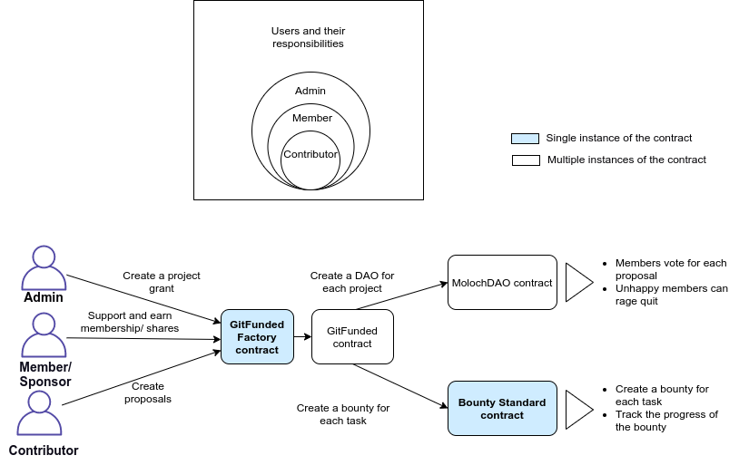

# Entities

GitFunded comprises of several diferent entities with different roles. The role
 of the entity depends on the action they perform on the platform.

## Project admin

Admin is responsible for creating the project by referencing a GitHub project. Admin has few specific roles:

* Providing initial details of the project
* Setting initial funding goals and expenses
* Accept the expenses and bounties for the issues/ tasks
* Deleting the project and thus refunding the funded amount
 

## Project member/ sponsor

Project sponsor will be part of the project by funding the desired project. Sponsor will also be the part of DAO such as MolochDAO, DAOStack

* Funds the project with any crypto currencies (currently ERC20 tokens)
* Receives the funded amount back in case project discontinues
* Makes decisions for all the proposals (Expenses and tasks)

## Project Contributor

Contributor of the project, often developer

* Creates proposals (issues/ tasks, expenses) for the project
* Needs to find a member to support the proposal
* Adds project expenses
* Works on an existing issue/ task

## Watcher

Everyone passing the GitFunded is a watcher. But logged in entities can choose to follow specific
 project to get notified about the activities.
 
 
## Technical architecture
The following technical architecture diagram consists of all the protocols and services used by GitFunded. 

### GitFunded actions involve:
* Creating a project (admin)
    * Add description
    * Set funding goal
* Add expense (admin, member)
* Accept expense (admin)
* Add task (admin, member)
* Accept task (admin)
* Fund project (sponsor, member, admin)
* Discontinue project (admin)

## High level architecture

## Contract architecture

GitFunded makes use of several standards set by some of the popular open source applications such 
as Standard Bounties, Gitcoin, Moloch DAO to achieve composability. After all, what is 
the point of an open decentralized infrastructure if we cannot achieve the interoperability between the DApps.

The standardization not only helps to achieve composability but also saves a lot of research and 
implementation time for new projects like ours. Below figure explains how we integrated with the existing contracts in GitFunded.   

